<div align="center">

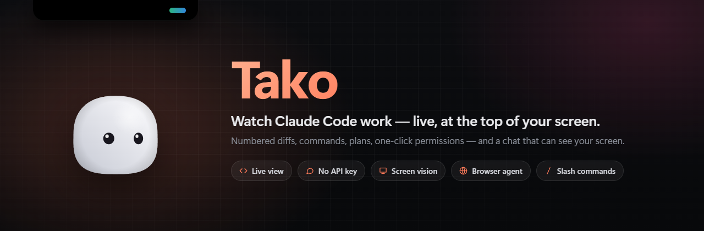

<br>

[English](README.md) · **Français**


**Une Dynamic Island pour Windows qui te montre ce que fait Claude Code — en vrai, en direct.**

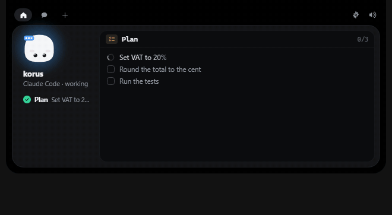

</div>

---

Claude Code travaille dans un terminal que tu ne regardes pas. Tako le rend visible sans te faire quitter ce que
tu fais : chaque fichier lu, le **diff de chaque modification avec ses vrais numéros de ligne**, la commande
lancée et **la fin de sa sortie**, son plan de tâches, et les demandes de permission auxquelles tu réponds en un
clic. L'îlot grandit avec ce qu'il montre, se replie quand tu t'en vas, et ne coûte rien quand il est caché.

À côté, un **chat qui passe par ton propre compte Claude Code** — sans clé API — qui lit ton projet, **regarde ton
écran quand ta question en parle**, connaît les **commandes `/`** de Claude, et peut devenir un **agent qui pilote
un vrai navigateur**.

## Sommaire

- [Fonctionnalités](#fonctionnalités)
- [Captures](#captures)
- [Installation](#installation)
- [Mises à jour](#mises-à-jour)
- [Brancher Claude Code](#brancher-claude-code)
- [Le chat, la vision et l'agent](#le-chat-la-vision-et-lagent)
- [Sécurité et garanties](#sécurité-et-garanties)
- [Architecture](#architecture)
- [Développement](#développement)
- [Arborescence](#arborescence)
- [Feuille de route](#feuille-de-route)
- [Licence](#licence)

---

## Fonctionnalités

### Vue live de Claude Code

Chaque appel d'outil devient une étape, affichée pour de vrai :

| Outil | Ce que l'îlot affiche |
|---|---|
| **Edit / MultiEdit** | Le diff rouge / vert avec les numéros de ligne réels et le contexte autour, tirés du `structuredPatch` de Claude Code. Pendant la modification, les nouvelles lignes s'écrivent en direct. |
| **Write** | Le fichier créé, ou le diff s'il en remplace un. |
| **Read** | Les lignes lues, avec coloration syntaxique (TS, JS, Rust, Python, PowerShell, JSON, TOML…). |
| **Bash / PowerShell** | La commande, puis la fin de sa sortie : vert quand ça passe, rouge quand ça casse, curseur tant qu'elle tourne. |
| **Grep / Glob** | Le motif et les résultats, `fichier:ligne  texte`. |
| **TodoWrite** | Le plan de Claude en cases à cocher : fait, en cours, à faire. |
| **Navigateur, web, sous-agents, MCP** | L'action, l'URL ou la requête, et le résultat quand il arrive. |

À gauche, les étapes du tour en cours — fait, en cours, échec, puis *Done*. Le panneau suit la dernière ; un clic
sur une étape plus ancienne la remet à l'écran, un second clic revient au direct.

**L'îlot s'adapte au contenu**, comme une Dynamic Island : un long diff ou une longue sortie le font grandir
jusqu'à 30 % en hauteur, des lignes de code larges l'élargissent, puis il revient à sa taille avec la même
animation à ressort.

### Toutes tes sessions en même temps

Chaque terminal Claude Code a sa pastille à côté du personnage, avec le nom du projet. **Rouge qui pulse** : il
t'attend. **Vert** : il a fini. Clique une pastille pour afficher sa vue live ; la session qui a besoin de toi passe
devant toute seule. Un petit anneau montre **le remplissage du contexte** (lu dans le transcript de la session), pour
savoir quand faire `/compact`.

### Quand Claude a fini

Une carte bilan : les derniers mots de Claude, les fichiers modifiés avec les lignes **+ajoutées −retirées**, le temps
passé et les tokens utilisés. Trois boutons :

- **Commit** — Claude écrit le message, tu le retouches et tu valides. Seulement les fichiers du tour, ton identité
  git, sans trailer.
- **Voir le diff** — tout le tour en un seul diff dans VS Code.
- **Annuler** — chaque fichier revient comme avant le tour, sauf ceux que tu as retouchés depuis. Avant chaque
  modification, Tako garde une copie du fichier sur ton PC pendant 3 jours.

### Mode relecture

En option : chaque modification de fichier attend ton OK dans l'îlot, avec le vrai diff et les numéros de ligne —
**Valider**, **Refuser**, ou tout valider pour le tour. Pas de réponse : la modif n'est pas appliquée. Tako fermé :
Claude Code fonctionne comme d'habitude. Une session en **mode auto** de Claude Code (ou acceptEdits / bypass) n'est
jamais retenue : Tako lit le mode de la session et l'affiche dans la vue live.

### Missions

`Alt+Maj+Espace` depuis n'importe où (ou l'onglet fusée) : tape une tâche, choisis le projet, et Tako lance Claude
Code dessus dans un nouveau terminal — tu suis tout en live depuis l'îlot.

### Permissions en un clic

Quand Claude Code demande une permission, l'îlot s'ouvre avec **Deny / Allow** (`N` / `Y`) et la commande, le
fichier ou l'URL exacts. Personne ne répond : Claude Code repose la question dans le terminal, comme si Tako
n'existait pas.

### Chat avec ton compte Claude Code

- **Sans clé API** : Tako lance ton Claude Code officiel en arrière-plan, avec ton abonnement.
- **En direct** : la réponse s'écrit au fil de l'eau, et l'îlot montre ce que Claude consulte (« Read · hooks.ts »).
- **Dans ton projet** : il lit le dossier de ta session Claude Code en cours.
- **Vision de l'écran** : si ta question parle de ce que tu vois — une erreur, une page, un design —, Claude
  prend lui-même une capture et la regarde.
- **Commandes `/`** : tape `/` et Tako propose les commandes et skills de Claude Code (`/code-review`, `/simplify`,
  `/usage`, `/context`…), au clavier ou à la souris.
- **Ouvre tes applis** : « ouvre Spotify », « lance Discord » — le chat ouvre l'appli installée du menu Démarrer et
  la laisse ouverte. Il ne ferme jamais rien.
- **Lecture seule** sinon : il ne modifie jamais tes fichiers. Un bouton vide la conversation.

### Agent navigateur

Active l'agent et le chat pilote un **vrai navigateur** (Playwright) : il ouvre des sites, lit les pages, clique,
remplit des formulaires. Chrome (ou Edge) ne se lance que quand le chat a vraiment besoin d'une page — une simple
question ne l'ouvre jamais — avec un profil à lui, et la fenêtre **reste ouverte** entre les messages et après
chaque réponse — c'est toi qui la fermes. Par défaut,
chaque action qui agit — ouvrir une page, cliquer, taper, exécuter du JavaScript — t'est demandée dans l'îlot avec
l'URL ou le texte exact ; le **mode auto** laisse tout passer.

### Widget d'utilisation

Tes limites Claude toujours sous les yeux : un petit widget en haut de l'écran, un anneau pour la session de 5 h,
un pour la semaine, et le temps avant le reset. Survole-le pour toutes les limites (tous modèles, par modèle).
**Glisse-le où tu veux** — il s'aimante au bord haut et à côté de l'îlot — ou choisis sa place dans les réglages ;
un clic droit le masque. Tape `/usage` dans le chat pour les mêmes chiffres en carte. Ils viennent du `/usage` de
ton propre Claude Code, rafraîchis toutes les 4 minutes.

Tako te **prévient aussi à 80 % et 90 %** avec l'heure où tu atteindras la limite à ce rythme, joue un son quand ta
limite de 5 h repart à zéro, et garde un **historique** dans les réglages : conso par jour, pic par semaine.

### Une vraie Dynamic Island

- **L'îlot s'étire comme sur iPhone** : volume, Verr. Maj, charge et batterie faible, clé USB branchée (avec
  « Ouvrir »), connexion perdue puis rétablie, téléchargement terminé (Ouvrir / Dossier) — l'îlot grandit une
  seconde, liseré de la couleur de l'événement, puis se replie.
- **Tes notifications** : Discord, WhatsApp, Outlook, Teams… arrivent en haut avec l'icône de l'appli, et l'onglet
  cloche les garde toutes. Un clic ouvre l'appli ; masque une appli en un clic ; un mode privé cache le texte.
- **Appels** : Discord, Teams, Zoom… utilisent ton micro et l'îlot affiche la durée de l'appel. Un point orange quand
  une appli utilise le micro, vert pour la caméra — survole-le pour savoir laquelle.
- **Aujourd'hui** : l'heure, la date et la météo dans l'îlot, et un clic ouvre le mois et les prévisions sur 5 jours.
- **Musique en cours** : Spotify, YouTube, Deezer… avec la pochette, précédent / lecture / suivant, la barre de
  progression et des barres qui suivent le vrai son de ton PC.
- **Plus grand pour les écrans de PC** : trois tailles dans les réglages, tout grandit d'un coup.
- **Ton PC** : processeur, mémoire et carte graphique en direct, dans une pastille.
- **L'îlot se divise en deux** : quand deux choses tournent en même temps — Claude qui bosse et un minuteur, un
  minuteur et la musique — une petite bulle se détache de l'îlot comme une goutte, avec une animation gluante.
  Clique-la pour ouvrir ce qu'elle montre.
- **Minuteur & Pomodoro** : cycles focus / pause / grande pause, le temps dans un anneau autour du personnage, une
  alarme animée, et l'îlot reste visible tant qu'il tourne.
- **Mode jeu** : un jeu ou une vidéo en plein écran et rien ne s'ouvre — l'îlot et le widget se cachent, les clics
  vont au jeu, les sons se coupent. À ton retour, une ligne te dit ce que tu as raté. Un terminal ou un éditeur en
  plein écran ne compte jamais comme un jeu.
- **Bluetooth** : un casque se connecte et l'îlot l'affiche avec sa batterie, comme sur iPhone.
- **Surveillance du VPN** : Mullvad, WireGuard, NordVPN, Proton… si le tunnel tombe, une alerte rouge te prévient que
  ton IP réelle est visible ; quand il revient, une verte avec le lieu.

### Mission Control

- **Plusieurs Claude à la fois** : écris une tâche, choisis le projet, et un Claude s'y met en arrière-plan, dans sa
  propre copie du projet (un worktree git dans `.claude/worktrees`, créé depuis ton commit actuel). Jusqu'à quatre en
  même temps, et tu vois chacun travailler en direct dans l'îlot.
- **Relire, puis fusionner** : une mission finie montre son diff et ses lignes. **Fusionner** commite son travail et
  le fusionne dans ta branche en un clic ; **Jeter** supprime sa copie. Ton dossier ne bouge pas tant que tu n'as pas
  fusionné, et Tako s'arrête et annule tout en cas de conflit ou si tu as des modifications non commitées.
- **Reprendre la main** : une mission qui attend une réponse, ou que tu veux pousser plus loin, s'ouvre dans un
  terminal.

### L'équipe de nuit

- **Des tâches pour cette nuit** : choisis « Cette nuit » dans Mission Control. Dès l'heure choisie (1 h par défaut)
  et jusqu'à 7 h, Claude les enchaîne une par une pendant que le PC reste éveillé.
- **Prudente par défaut** : personne ne peut répondre la nuit, donc les missions de nuit n'ont droit qu'aux
  modifications de fichiers, aux tests, aux builds et à git en lecture ; tout le reste est refusé tout de suite (le
  mode `dontAsk` de Claude Code). Le mode auto de Claude est en option.
- **Le briefing du matin** : à ton retour, l'îlot s'ouvre sur le rapport de la nuit et Tako te le lit : ce qui est
  prêt à fusionner et ce qui a bloqué.

### Tako en mode Jarvis

- **« Hey Tako »** : dis-le et l'îlot s'ouvre, le personnage penche la tête et t'écoute, avec des barres qui suivent
  ta voix et tes mots qui s'affichent pendant que tu parles. Pose ta question à voix haute : Claude répond avec ton
  propre compte Claude Code et Tako lit la réponse avec une voix naturelle. « Tako, stop » coupe la parole.
- **Des voix naturelles** : Siwis, Pierre ou Jessica, des voix neuronales [Piper](https://github.com/rhasspy/piper) qui
  tournent sur ton PC (environ 85 Mo, téléchargées une fois). La voix de Windows reste disponible.
- **Ta voix reste sur ton PC** : Windows repère « Hey Tako », puis [Whisper](https://github.com/ggml-org/whisper.cpp)
  transcrit ta question en local, en une demi-seconde environ. Le modèle (190 Mo) se télécharge une seule fois et
  son SHA-256 est vérifié.
- **Réponses instantanées** : l'heure, la date, la météo, « mets un minuteur de 10 minutes », « pause », « musique
  suivante » — tout de suite, sans Claude.
- **Permissions à la voix** (en option) : « Tako, oui » autorise et « Tako, non » refuse la demande affichée. Un
  « oui » ne compte que si Tako est sûr de l'avoir entendu.
- La musique se met en pause pendant que Tako écoute ou parle, puis reprend. Coupé pendant un appel et en mode jeu.

### La Lentille

Copie quelque chose et l'îlot propose quoi en faire :

- **Une erreur** → **Expliquer** avec Claude, ou **Réparer** : une mission Claude Code prête à lancer dans ton
  dernier projet.
- **Un texte en anglais** → **Traduire** en français.
- **Un numéro de colis** → **Suivre** le colis (La Poste, Colissimo, UPS, DHL…).
- **Une adresse** → **Itinéraire** ou la carte dans Google Maps.

Le texte copié est lu sur ton PC, seulement pour le reconnaître ; rien ne part tant que tu ne cliques pas. Ce que
tu copies depuis un gestionnaire de mots de passe est ignoré.

### Un personnage qui vit sa vie

Le personnage **danse sur ta musique** (sur le vrai rythme du son de ton PC), **transpire** quand le processeur est
à fond, **s'endort la nuit** quand rien ne se passe et s'étire quand tu reviens, et **fait la fête quand tes tests
passent** dans une session Claude Code — avec une bulle « Tests réussis ».

### Des animations comme sur iPhone

- **Effet gelée** : l'îlot s'étire et ondule un peu quand il grandit et se replie.
- **Appui long** sur l'îlot replié pour ouvrir l'activité en cours ; **Maj + molette** (ou un glissement latéral sur
  le pavé tactile) pour passer d'une activité à l'autre.
- Les vues se fondent avec un flou, les barres du visualiseur prennent **les couleurs de la pochette**, et un réglage
  « Réduire les animations » calme tout.
- **Les deux côtés de l'îlot** : la date et la météo (ou ce que fait Claude) à gauche, l'heure ou tes notifications
  à droite.

### Et aussi

- **Dépôt de fichiers** : glisse un fichier sur l'îlot, il arrive dans le chat. L'îlot caché se réveille quand un
  fichier approche du haut de l'écran.
- **Intégrations** : GitHub, Vercel, n8n, Resend, Notion, Cal.com, Stripe — jusqu'à 4 pastilles à côté du
  personnage, clés rangées dans le Gestionnaire d'identification Windows.
- **Réglages complets** : refaits de zéro, une page par module avec un bouton « Tester » partout, et une recherche
  qui retrouve n'importe quel réglage.
- **Discret** : compact quand Claude bosse, ouvert au clic, replié tout seul, et une option pour ne pas s'ouvrir
  quand Claude a fini — pratique en jeu. Pas de fenêtre dans la barre des tâches, pas de console.

---

## Captures

<table>
<tr>
<td width="50%">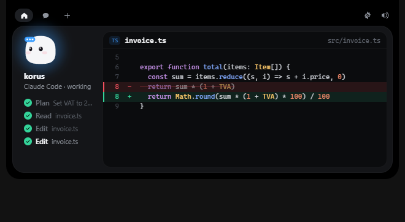<br><sub>Le diff d'une modification, numéros de ligne réels</sub></td>
<td width="50%">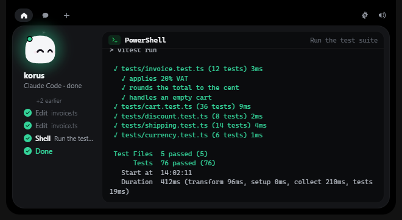<br><sub>La commande et la fin de sa sortie — l'îlot a grandi pour tout montrer</sub></td>
</tr>
<tr>
<td>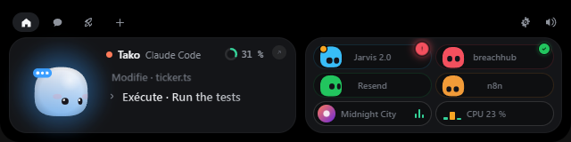<br><sub>Trois sessions, anneau de contexte, musique et stats du PC</sub></td>
<td>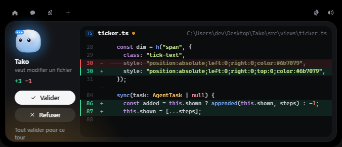<br><sub>Mode relecture : la modif attend ton OK</sub></td>
</tr>
<tr>
<td>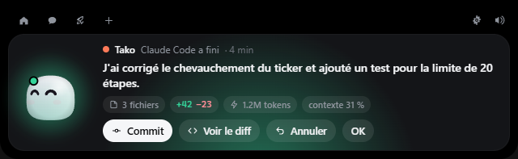<br><sub>Le bilan du tour : Commit, diff, Annuler</sub></td>
<td>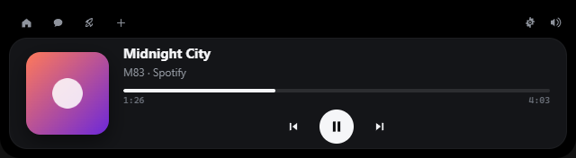<br><sub>Ce qui joue, avec les commandes</sub></td>
</tr>
<tr>
<td>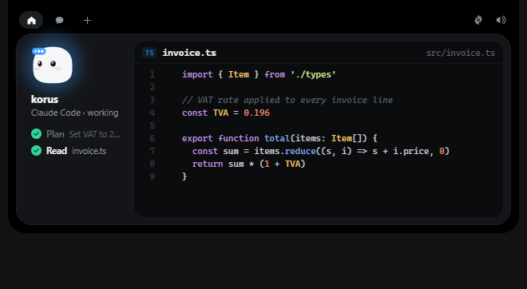<br><sub>Un fichier lu, avec coloration</sub></td>
<td>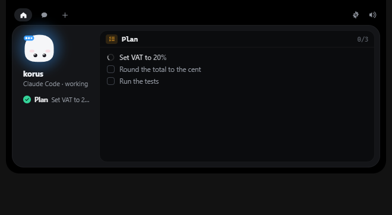<br><sub>Le plan de tâches de Claude</sub></td>
</tr>
<tr>
<td>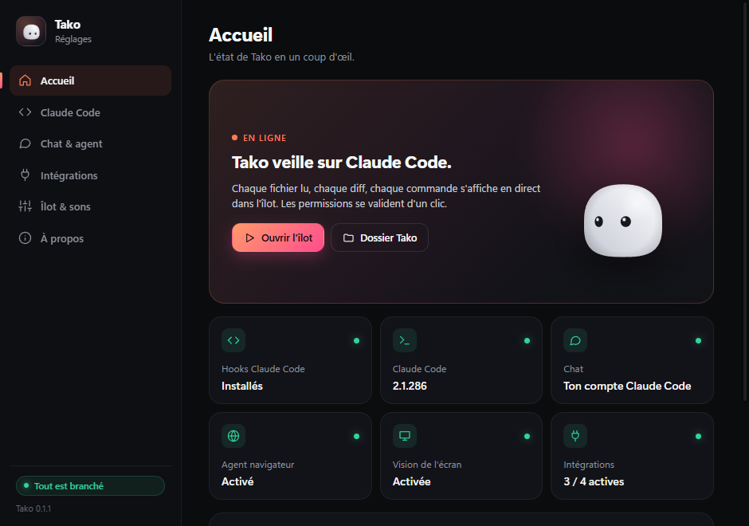<br><sub>Réglages : l'état de tout en un coup d'œil</sub></td>
<td>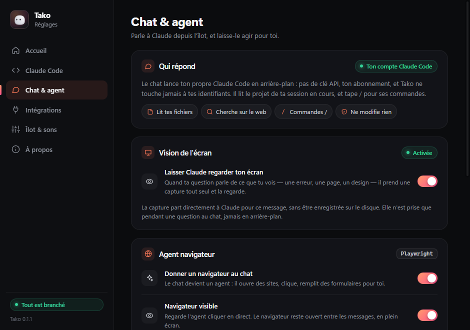<br><sub>Chat, vision de l'écran et agent navigateur</sub></td>
</tr>
<tr>
<td>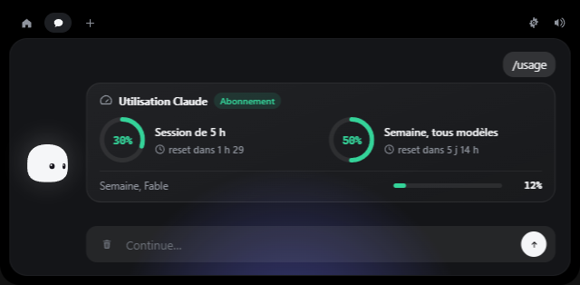<br><sub><code>/usage</code> dans le chat</sub></td>
<td align="center">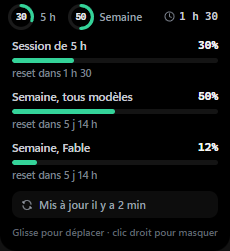<br><sub>Le widget d'utilisation, survolé</sub></td>
</tr>
<tr>
<td>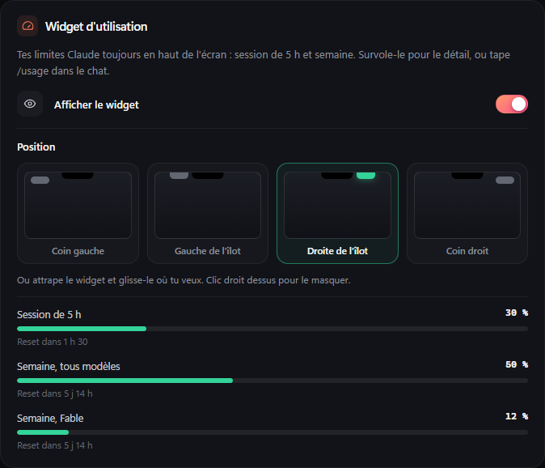<br><sub>La place du widget — ou glisse-le</sub></td>
<td>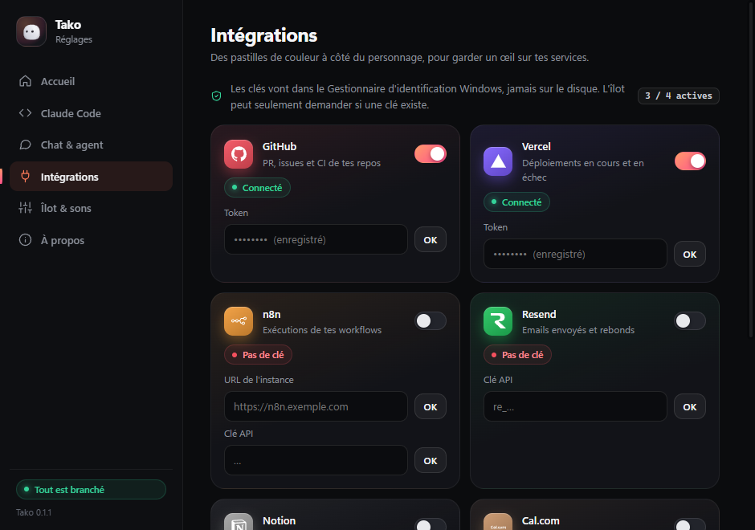<br><sub>Les intégrations</sub></td>
</tr>
</table>

<sub>Captures prises avec les démos intégrées (`?demo`), qui rejouent une session fictive.</sub>

---

## Installation

Il te faut [Rust](https://rustup.rs), [Node 20+](https://nodejs.org) et les **MSVC Build Tools** (Visual Studio
Build Tools, charge « Développement Desktop en C++ »). WebView2 est déjà dans Windows 10 / 11. Pour le chat sans
clé API, [Claude Code](https://code.claude.com) installé et connecté à ton compte.

```powershell
git clone https://github.com/OnelightCyber/Tako.git
cd Tako
npm install
npm run pack            # l'app et son installeur, dans release/
```

Ensuite, au choix :

- **Sans installer** : `target\release\tako.exe`.
- **Avec l'installeur** : `release\Tako-Windows-setup.exe` (pour ton utilisateur, sans droits admin).

L'installeur n'est pas encore signé : SmartScreen peut prévenir. Compilé par toi depuis les sources, c'est attendu.

## Mises à jour

Tako vérifie GitHub 15 secondes après son lancement, puis toutes les 6 heures. Quand une version est publiée,
**Réglages → À propos** propose de l'installer : téléchargement, installation et redémarrage se font tout seuls.
Chaque mise à jour est signée ; Tako refuse tout fichier qui ne porte pas la signature du projet.

Publier une version :

```powershell
npm run release 0.2.0
```

Le script met la version à jour partout, crée le commit et le tag `v0.2.0`, et les pousse. GitHub Actions compile
alors l'installeur, le signe et publie la release avec son `latest.json` — le fichier que chaque Tako installé
consulte. La clé de signature reste sur la machine du mainteneur et dans les secrets du repo, jamais dans le code.

## Brancher Claude Code

Icône Tako dans la zone de notification → **Settings… → Claude Code → Installer les hooks…**

- Le **diff exact** de `%USERPROFILE%\.claude\settings.json` s'affiche avant toute écriture.
- Une **sauvegarde datée** est faite à côté (`settings.json.bak-AAAAMMJJ-HHMMSS`).
- Tes propres hooks ne sont jamais touchés ; désinstaller ne retire que ceux de Tako.

Le relais `tako-hook.exe` est copié dans `%LOCALAPPDATA%\Tako\bin\` à chaque lancement. Il marche depuis
n'importe quel terminal : Windows Terminal, PowerShell, VS Code, Git Bash.

---

## Le chat, la vision et l'agent

### Ce que Tako lance

```
claude -p --output-format stream-json --verbose --include-partial-messages
       --setting-sources project,local --strict-mcp-config
       --tools Read,Grep,Glob,WebSearch,WebFetch
       --system-prompt "<prompt court de Tako>" [--resume <session>] [--add-dir <dossier>]
       [--mcp-config <tako + playwright>] [--settings <garde-fou de l'agent>]
```

- Le prompt passe par **stdin**, jamais par un shell.
- **Pas tes réglages utilisateur** (donc pas de hooks qui reviendraient dans l'îlot, pas de plugins), **pas tes
  serveurs MCP**, un prompt système court : environ 3,7 k tokens au premier message, presque rien ensuite grâce au
  cache. Ça compte sur ton quota Claude, comme n'importe quel usage de Claude Code.
- Lancé depuis ton dossier personnel, il part d'un dossier neutre et lit ton dossier via `--add-dir`, pour ne pas
  charger ton `~/.claude/settings.json` comme réglages de projet.

### La vision de l'écran

`tako-hook.exe mcp` est un petit serveur MCP avec un seul outil, `screenshot`. Claude décide lui-même de s'en servir
quand la question parle de ce que tu vois. La capture de l'écran principal est réduite à 1568 px (la taille idéale
pour la vision de Claude) et part directement à Claude **sans être écrite sur le disque**. Elle n'est prise que
pendant une question au chat, jamais en arrière-plan, et se désactive dans les réglages.

### L'agent navigateur

Tako démarre `@playwright/mcp` comme **serveur HTTP local qui reste allumé** (`--port`, `--shared-browser-context`)
et le chat s'y connecte : le navigateur survit à la fin d'une réponse et reste ouvert entre les messages. Il utilise
un profil à lui (`%LOCALAPPDATA%\Tako\browser-profile`), jamais ton profil Chrome, et s'arrête avec Tako.

Hors mode auto, chaque action qui agit passe par un hook `PreToolUse` : le relais met l'agent en pause, l'îlot
affiche **Allow / Deny** avec l'URL ou le texte exact, et **sans réponse l'action est refusée**. Lire la page et
faire des captures ne demande rien.

### Pourquoi c'est réglo

Tako ne lit, ne stocke et ne transmet **jamais** tes identifiants Claude. Les
[conditions d'Anthropic](https://code.claude.com/docs/en/legal-and-compliance) interdisent à une application tierce
de proposer sa propre connexion claude.ai ou de récupérer des tokens de session ; elles n'empêchent pas un
utilisateur de se connecter **lui-même** au binaire Claude Code non modifié avec son propre abonnement. C'est
exactement ce qui se passe : chacun utilise son propre compte, sur sa machine.

---

## Sécurité et garanties

- **Claude Code n'est jamais bloqué ni ralenti.** Tako fermé, lent ou planté : le relais abandonne en 300 ms et
  Claude Code continue. Une exécution du relais tient dans 2 s, 110 s quand un humain doit répondre.
- **Silence = comportement normal.** Pas de réponse à une permission : le terminal reprend la main.
- **Les actions de l'agent échouent fermées.** Pas de décision, pas d'action.
- **Le mode relecture échoue fermé quand Tako tourne** : pas de réponse à temps, Tako en pause, ou trop de modifs
  d'un coup — la modif est refusée. Il couvre les fichiers, pas les commandes. Tako fermé : Claude Code applique ses
  propres permissions. Un « autoriser » de Tako ne passe jamais outre tes règles `permissions.deny`.
- **Pas de clic qui dérape** : une permission ou une relecture qui vient d'apparaître ignore les clics pendant
  0,7 s, un double-clic ne valide jamais la suivante.
- **Les copies pour Annuler restent sur ton PC** : avant chaque modif, une copie du fichier va dans
  `%LOCALAPPDATA%\Tako\snapshots` pendant 3 jours (10 Mo par fichier, 1 Go au total). Les fichiers sensibles —
  `.env`, clés, certificats, `.ssh`, `.aws`… — ne sont jamais copiés, leur contenu n'est jamais envoyé à Claude pour
  écrire un message de commit, et le bouton Commit ne les committe pas.
- **`settings.json` n'est jamais écrasé** : fusion, diff affiché, sauvegarde datée, écriture seulement après ton clic
  et seulement si le fichier n'a pas changé depuis le diff.
- **Aucune permission accordée sans clic explicite** — ou, seulement si tu l'actives, un « Tako, oui » explicite.
- **Secrets** dans le Gestionnaire d'identification Windows (service `dev.tako.island`) ; l'interface peut seulement
  demander si une clé existe.
- **Pas de télémétrie.** Les requêtes réseau vont vers les services que tu configures, et vers Claude via ton propre
  Claude Code. Ta voix ne quitte jamais ton PC : le mot de réveil et la transcription tournent en local, seule ta
  question écrite part vers Claude. Le modèle vocal vient une fois de Hugging Face, SHA-256 vérifié.
- **La Lentille lit, n'envoie pas** : le texte copié est reconnu sur place ; il ne part vers Claude, un transporteur
  ou Google Maps que quand tu cliques sur une action, et les copies des gestionnaires de mots de passe sont ignorées.
- **Rien n'est injecté en HTML** : le code de tes fichiers est construit nœud par nœud, jamais via `innerHTML`.
- **0 % de CPU caché** : animations, suivi du curseur, musique et stats du PC s'arrêtent ; seules 8 lectures Win32
  par seconde guettent un fichier glissé vers l'îlot caché, plus la reconnaissance vocale de Windows quand
  l'assistant vocal est activé.
- **Le relais vérifie à qui il parle** : le pipe nommé est lié à ton compte Windows (SID) et le serveur est contrôlé
  avant chaque envoi. Les programmes qui tournent sous ton propre compte sont considérés comme fiables, comme pour
  tout ce qu'ils peuvent déjà faire en ton nom.

---

## Architecture

```
 Claude Code (n'importe quel terminal)
        │  JSON du hook sur stdin, à chaque événement
        ▼
 tako-hook.exe ───────────► 300 ms pour se connecter, sinon il sort sans rien dire
        │  allège le JSON : garde le diff et la fin des sorties ; textes ≤ 2 000 car.,
        │  listes ≤ 60, le tout ≤ 256 Ko
        ▼
 \\.\pipe\tako-<SID>         pipe nommé, même utilisateur vérifié des deux côtés
        │
        ▼
 Rust · src-tauri/src/pipe.rs ──► événement "hook" vers la webview de l'îlot
        │                          permission ou action d'agent : attente de la décision
        ▼
 Îlot · src/island/hooks.ts
        ├─ src/core/activity.ts   PreToolUse → étape « en cours », PostToolUse → vrai résultat
        └─ src/views/session.ts   étapes + diff / code / terminal / plan, taille ajustée au contenu

 Chat · src-tauri/src/claude_cli.rs
        claude -p (stream-json) ──► chat-delta / chat-status vers l'îlot
          ├─ MCP « tako »        tako-hook.exe mcp → screenshot
          └─ MCP « playwright »  src-tauri/src/browser.rs → serveur HTTP local persistant

 Utilisation · src-tauri/src/usage.rs
        claude -p "/usage" toutes les 4 min ──► usage-updated vers le widget (src/usage)
```

---

## Développement

```powershell
npm run tauri dev       # l'app complète, rechargement à chaud
npm run dev             # juste l'interface dans un navigateur
```

- **Compiler** : Whisper est compilé depuis ses sources, il faut donc CMake et libclang. Dépose `libclang.dll`
  dans `tools/libclang/`, ou installe LLVM (`winget install LLVM.LLVM`) et règle `LIBCLANG_PATH` sur son dossier
  `bin` (par exemple `C:\Program Files\LLVM\bin`), ce qui remplace la valeur par défaut de `.cargo/config.toml`.
  Ce fichier active aussi les optimisations `/O2` que cmake-rs oublie avec MSVC.
- **Démos de l'îlot** : <http://127.0.0.1:1420/?alive=glance> (aussi `session`, `lens-error`, `lens-address`,
  `lens-tracking`, `lens-english`, `voice-listen`, `voice-think`, `voice-answer`, `voice-fail`).
- **Démo de la vue live** : `npm run dev` puis <http://127.0.0.1:1420/?demo> (ajoute
  `&until=plan|read|edit|diff|shell` pour figer une étape).
- **Réglages de démo** : <http://127.0.0.1:1420/settings.html?demo>.
- **Bannière du README** : <http://127.0.0.1:1420/dev/banner.html>.
- **Démo du dépôt de fichiers** : <http://127.0.0.1:1420/dev/upload-preview.html>.
- **Démo de l'utilisation** : <http://127.0.0.1:1420/?demo=usage> (la carte `/usage`) et
  <http://127.0.0.1:1420/usage.html?open> (le widget).
- **Nouvelles vues** : <http://127.0.0.1:1420/?feature=overview> (aussi `review`, `finished`, `music`, `system`,
  `mission`, `usage`).
- **Tests** : `cargo test -p tako-hook --release` (relais, garde-fou de l'agent, serveur MCP) et
  `cargo test -p tako --lib` (hooks, fichiers, sessions, Annuler et Commit sur un vrai dépôt, prévisions et alertes
  de `/usage`, placement du widget, musique, stats du PC).
- **Icônes** : `npm run icons` les redessine depuis `scripts/gen-icons.mjs`.
- **Log** : `%LOCALAPPDATA%\Tako\tako.log` — événements des hooks, décisions, forme des résultats d'outils (clés
  seulement), drags, navigateur, erreurs du chat. Il reste sur ta machine.

## Arborescence

```
src/                      interface de l'îlot (TypeScript, sans framework)
  core/                   état, géométrie, animations, sons, pont vers Rust
    activity.ts           les actions de Claude : diffs, sorties, plan
  island/                 machine à états, hooks Claude Code, intégrations
  views/                  les vues de l'îlot
    session.ts            la vue live
    chat.ts               le chat et les commandes /
    fit.ts                taille de l'îlot selon le contenu
    highlight.ts          coloration syntaxique, en DOM pur
    pro-icons.ts          icônes au trait
    brand-logos.ts        logos des intégrations
  mascot/                 le personnage et l'animation d'accueil (Canvas 2D)
    look.ts               la forme et les couleurs du personnage
  settings/               la fenêtre de réglages
  usage/                  le widget d'utilisation
src-tauri/src/            backend Rust
  claude_cli.rs           chat via le Claude Code de l'utilisateur
  usage.rs                le /usage de Claude Code, historique, prévision, alertes
  widget.rs               la fenêtre du widget : places, drag, aimantation
  sessions.rs             contexte, bilan du tour, Annuler, Commit, diff, missions
  media.rs                ce qui joue (sessions média Windows)
  voice.rs                « Hey Tako », écoute, réponses à voix haute
  tts.rs, assets.rs       voix naturelles Piper, téléchargements vérifiés
  squad.rs                Mission Control et l'équipe de nuit : worktrees, agents en fond, fusion
  mic.rs, stt.rs          capture du micro, fin de phrase, Whisper en local
  clipboard.rs            la Lentille : ce que tu copies, reconnu sur place
  sysstats.rs             processeur, mémoire, carte graphique
  browser.rs              serveur Playwright persistant de l'agent
  updater.rs              mises à jour signées depuis les releases GitHub
  pipe.rs                 pipe nommé, permissions, actions d'agent
  hooks.rs                installation / désinstallation des hooks
  island.rs               fenêtre, clic traversant, curseur, dépôt de fichiers
hook/src/                 tako-hook.exe
  main.rs                 le relais des hooks
  snapshot.rs             une copie de chaque fichier avant que Claude le modifie
  review.rs               le diff affiché en mode relecture
  mcp.rs, screen.rs       le serveur MCP de capture d'écran
sounds/                   les 28 sons de Tako
dev/                      démos et bannière (jamais livrées)
docs/                     bannière, GIF et captures
```

---

## Feuille de route

- [x] Vue live : étapes, vrais diffs numérotés, lecture, terminal, plan
- [x] Îlot qui grandit avec son contenu
- [x] Chat via le compte Claude Code, sans clé API
- [x] Vision de l'écran à l'initiative de Claude
- [x] Commandes `/` de Claude Code dans le chat
- [x] Agent navigateur persistant, avec garde-fou et mode auto
- [x] Réglages complets, logos des intégrations, mises à jour signées
- [x] Personnage, icône et sons propres à Tako
- [x] **Widget d'utilisation** : limites de 5 h et de la semaine à l'écran, déplaçable, et `/usage` dans le chat
- [x] **Multi-sessions** avec une pastille par terminal et un anneau de contexte
- [x] **Bilan du tour** avec Commit, diff et Annuler, et un **mode relecture** en option
- [x] **Missions** depuis un raccourci global
- [x] Alertes de limite, prévision et historique ; musique ; stats du PC
- [x] **Îlot multifonction** : HUD à l'iPhone, notifications, appels, téléchargements, météo
- [x] **Mode Jarvis**, **Lentille**, personnage vivant et animations à la Apple
- [x] **Mission Control** et **l'équipe de nuit**
- [ ] Réglages en anglais
- [ ] **Monitoring serveurs** : up / down, CPU, RAM, disque, conteneurs
- [ ] **Garde-fous de session** : bloquer les commandes dangereuses, signaler l'accès aux secrets
- [ ] Installeur signé

---

## Licence

- **Code** : MIT — voir [`LICENSE`](LICENSE).
- **Nom, personnage, icône, sons et visuels** : tous droits réservés — voir [`LICENSE-ASSETS.md`](LICENSE-ASSETS.md).
  Les forks sont les bienvenus avec leur propre nom, icône, personnage et sons.
- **Éléments tiers** : voir [`THIRD_PARTY_NOTICES.md`](THIRD_PARTY_NOTICES.md).

Claude et Claude Code sont des marques d'Anthropic. Tako n'est ni fait, ni approuvé par Anthropic.
